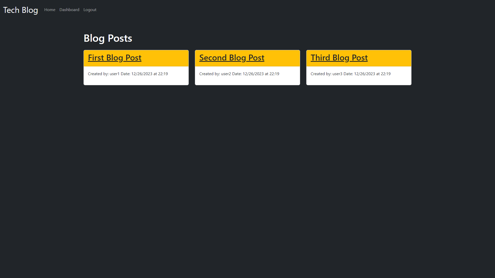

# Tech Blog 

## Description
Share your tech insights seamlessly with our CMS. Create, edit, and delete blog posts effortlessly. Engage in discussions through comments and explore a vibrant community. Your security is our priority with express-session. Join the conversation today! 🚀

## Deployed Application URL
[Tech Blog](https://tech-blog-by-mariam-ac876a5d1ff9.herokuapp.com/)

## Screenshot

## Table of Contents
- [Installation](#installation)
- [Usage](#usage)
- [Test](#test)
- [Contributor Guidelines](#contributor-guidelines)
- [Credits](@credits)
- [License](#license)
- [Questions](#questions)

## Installation
- Clone repository.
- Run 'npm install express-handlebars@latest mysql2@latest sequelize@latest sequelize-cli@latest dotenv@latest bcrypt@latest express@latest express-session@latest connect-session-sequelize@latest' to install required dependencies.
- Create an .env file and put you MySQL username and password.
- Log in to MySQL with 'mysql -u your_username -p', and enter your MySQL password.
- In MySQL, import the database schema using 'source db/schema.sql;'.
- Exit MySQL using 'EXIT;"
- Migrate the database by running 'npx sequelize-cli db:migrate'.
- Seed the database with the data by running 'npx sequelize-cli db:seed:all'.

## Usage
- Run 'npm start' to listen to the server.
- navigate to 'http://localhost:3001/'
- Post Blogs!

## Contributor Guidelines

## License

This project is licensed under the [MIT](https://opensource.org/licenses/MIT) license.

## Questions

For any questions or additional information, please contact me:
- [Email](mailto:mariam.miladd@gmail.com?subject=[GitHub]%20Dev%20Connect)
- [GitHub](https://github.com/mariamdawood)